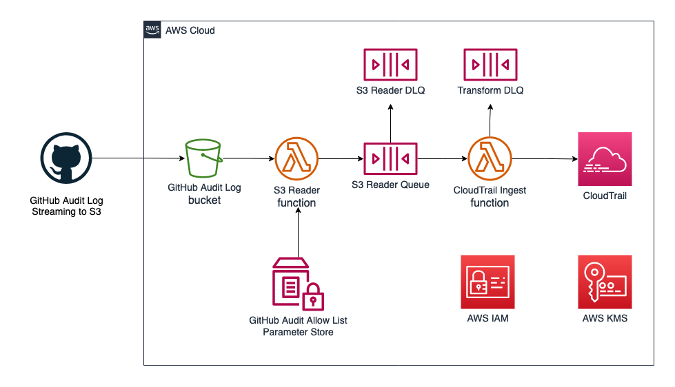

# GitHub Audit Log to CloudTrail Lake Integration

## Introduction
A reference architecture to integrate GitHub Audit Log to AWS CloudTrail Lake. This solution uses GitHub Audit Log streaming to Amazon S3 as the data source, transform and send the events to CloudTrail Lake data store. 



## Getting Started

### General prerequisites

You must have access as GitHub Enterprise Account owner to configure Audit Log Streaming to S3. To learn more about GitHub audit log, check the [GitHub documentation](https://docs.github.com/en/enterprise-cloud@latest/admin/monitoring-activity-in-your-enterprise/reviewing-audit-logs-for-your-enterprise/about-the-audit-log-for-your-enterprise)

You can create your own S3 bucket and supply it as a parameter in the deployment below. Additionally, you can choose to create a new bucket and configure your GitHub Audit Log Streaming to the new S3 bucket as destination.

### Initiate the CloudTrail Lake integration

* To start the integration, navigate to the AWS CloudTrail console. 
* Choose **Lake**, **Integrations** and **Available applications** tab.
* Select **GitHub** from the list of available applications. 
* Select **Add Integration** 
* Under **Integration details** update the integration name as required or keep the default value.
* Under **Event delivery location**, choose existing event data stores or create a new event data store for GitHub.  
* Under **Resource policy** section, leave the default resource policy if you deploying the solution on the same AWS account where CloudTrail Lake is running. 
  * **Optional** : if you deploying the solution on separate AWS account, select **Add AWS account** and enter the account id.
* Add optional tags as required and select **Add integration** to confirm.
* After you initiated the integration, a dedicated channel is configured to allow the solution to send GitHub audit log. 
* Locate the newly created GitHub integration from the **Managed integrations** tab, copy the **Channel ARN** value and follow the remaining steps below.

After you initiated the integration, a dedicated channel is configured to allow the solution to send GitHub audit log. To activate this integration, copy the channel ARN value and follow the remaining steps below.

### Deploy using Terraform 

Refer to the [Terraform module documentation](./terraform/terraform-aws-cloudtrail-lake-github-audit-log/README.md) to get started.

### Deploy using SAM CLI

Refer to the [SAM directory](./SAM/README.md) to get started.

### (Optional) Using existing S3 bucket

If you use an existing S3 bucket, follow instruction below to setup S3 event to Lambda function.

Take the `GitHubS3ReaderFunction` ARN value from the SAM cli output or `github_auditlog_s3bucket` ARN value from the Terraform module output. The format will be: `arn:aws:lambda:{region}}:{account id}:function:GitHubS3ReaderFunction-{random-id}`

Run command below to create S3 event notification configuration, replace the placeholder for Lambda ARN wit the value from SAM / Terraform module output.
```
LAMBDA_FUNCTION_ARN="{{change this with Lambda Arn from the SAM cli output}}"
cat << EOF > notification.json
{
    "LambdaFunctionConfigurations": [
    {      
      "Id": "GitHubS3ReaderFunction",
      "LambdaFunctionArn": "$LAMBDA_FUNCTION_ARN",
      "Events": ["s3:ObjectCreated:Put"],
      "Filter": {
        "Key": {
          "FilterRules": [
            {
              "Name": "suffix",
              "Value": ".json.log.gz"
            }
          ]
        }
      }
    }
  ]
}
EOF
``` 

Run command below to apply the S3 event notification configuration.
```
BUCKET_NAME={{change this with your S3 bucket for GitHub Audit log streaming}}
aws s3api put-bucket-notification-configuration --bucket $BUCKET_NAME --notification-configuration file://notification.json
```

## Setup GitHub Audit Log streaming to S3

GitHub provides documentation on how to setup audit Log streaming to S3, check the guide for [setting up streaming to Amazon S3](https://docs.github.com/en/enterprise-cloud@latest/admin/monitoring-activity-in-your-enterprise/reviewing-audit-logs-for-your-enterprise/streaming-the-audit-log-for-your-enterprise#setting-up-streaming-to-amazon-s3). When prompted for S3 bucket, provide the S3 bucket name from the step earlier.

## Validating the setup

To test this integration, perform actions in your GitHub organization that matches the event filter. Note that the default filter includes `repo.create*,repo.change*,business.set*,integration.*,git.*` and you can modify this by updating the SAM clie parameter `GitHubAuditAllowList`.

From the CloudTrail Lake page, open the Editor tab and enter the sample query below. Change the data-store placeholder with your data store id.
```
SELECT 
    eventData.eventSource as eventSource, 
    awsRegion, 
    eventData.eventname as eventName, 
    eventData.eventTime as eventTime, 
    eventData.requestParameters as requestParameters
    eventData.userIdentity.type as eventType 
FROM 
    {{replace with your event data store id}}
WHERE 
    eventData.eventSource = 'github.audit.streaming' and 
    eventTime > '2022-08-31 00:00:00' and eventTime < '2022-09-30 00:00:00
```

## Sample Query

### Find repository with permissions switched to public
```
SELECT 
	eventData.eventTime as eventTime,  
	eventData.eventSource as eventSource, 
    eventData.eventname as eventName,
    element_at(eventData.userIdentity.details, 'GitHubOrganization') as orgName,
    element_at(eventData.userIdentity.details, 'Repository') as repoName,
    element_at(eventData.requestParameters, 'visibility')as repoVisibility,
    eventData.requestParameters as requestParameters 
FROM 
	{{replace with your data store id}}
WHERE 
	eventData.eventSource = 'github.audit.streaming' and 
    eventTime > '2022-09-01 00:00:00' and eventTime < '2022-09-30 00:00:00' and
    eventData.eventName = 'repo.access' and 
    element_at(eventData.requestParameters, 'visibility') = 'public'
```

### Find recently invited members of the organization
```
SELECT 
	eventData.eventTime as eventTime,  
	eventData.eventSource as eventSource, 
    eventData.eventname as eventName,
    element_at(eventData.userIdentity.details, 'GitHubOrganization') as orgName,
    element_at(eventData.requestParameters, 'user') as user,
    eventData.requestParameters as requestParameters 
FROM 
	{{replace with your data store id}}
WHERE 
	eventData.eventSource = 'github.audit.streaming' and 
    eventTime > '2022-09-01 00:00:00' and eventTime < '2022-09-30 00:00:00' and 
    eventData.eventname = 'org.invite_member'
```

### Find user with most frequent git clone activity
```
SELECT 
    eventData.eventname as eventName,
    eventData.userIdentity.principalId as user,
    COUNT(*) AS apiCount
FROM 
	{{replace with your data store id}}
WHERE 
	eventData.eventSource = 'github.audit.streaming' and 
    eventTime > '2022-09-01 00:00:00' and eventTime < '2022-09-30 00:00:00' and 
    eventData.eventname = 'git.clone'
GROUP BY eventData.eventname, eventData.userIdentity.principalId
HAVING count(*) > 10
```

## Pricing

Your cost depends on how much GitHub audit log activity are generated from your GitHub organization and enterprise account. To filter events that you want to send to CLoudTrail Lake, modify the parameter `GitHubAuditAllowList` accordingly.

For AWS CloudTrail Lake, you pay for ingestion and storage together. You can store your data for up to seven years. Choose which data to analyze, and pay as you go. Check the [CloudTrail Lake pricing for more information](https://aws.amazon.com/cloudtrail/pricing/).

You also pay the cost for storing the GitHub Audit Log in Amazon S3. If you use the S3 bucket created as part of the solution, the S3 bucket is configured with Intelligent tiering to automatically move files to infrequent access and archive access tier. Your S3 cost depends on how frequent GitHub audit logs streaming to S3. Check [S3 pricing for more information](https://aws.amazon.com/s3/pricing).

The solution also uses [AWS Lambda](https://aws.amazon.com/lambda/pricing/), [Amazon SQS](https://aws.amazon.com/sqs/pricing/) to queue and transform the event log to CloudTrail Lake and [AWS KMS](https://aws.amazon.com/kms/pricing/) to encrypt all data at rest. Please check the relevant pricing information for more information. 

To monitor the cost, use [AWS Budgets](https://aws.amazon.com/aws-cost-management/aws-budgets/) and [AWS Cost Anomaly Detection](https://aws.amazon.com/aws-cost-management/aws-cost-anomaly-detection/) to detect any sudden unplanned charges.


## Additional Information
To learn more about CloudTrail Lake, check the [documentation on AWS page](https://docs.aws.amazon.com/awscloudtrail/latest/userguide/cloudtrail-lake.html).